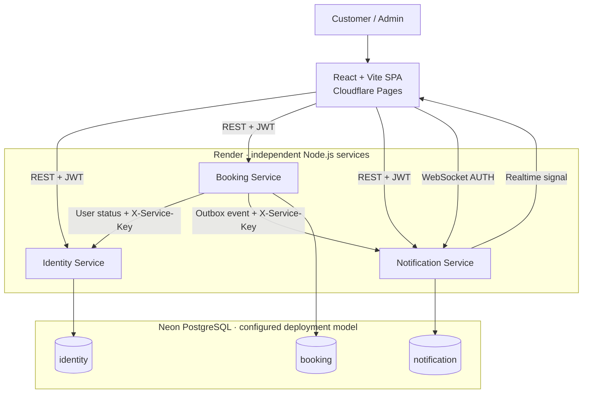
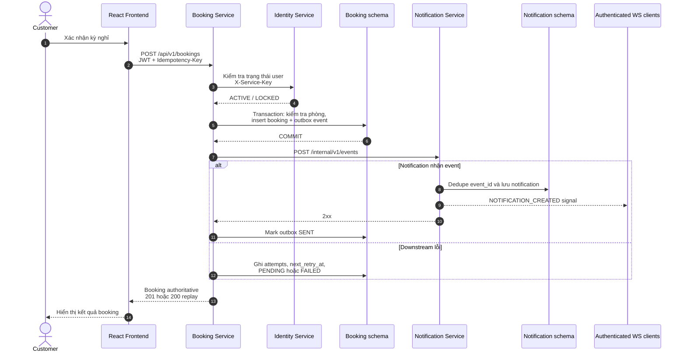

<div align="center">

# CloudStay

### Cloud-native Hotel Booking Platform

Nền tảng đặt phòng khách sạn xây dựng theo kiến trúc microservices, kết nối trải nghiệm React hiện đại với các dịch vụ Node.js triển khai độc lập trên cloud.

[**Live Demo**](https://mirocloudfe.pages.dev) · [Frontend Repository](https://github.com/CrissNguyenKhanh/MiroCloudFE) · [Backend Repository](https://github.com/CrissNguyenKhanh/cloud-room-booking)


</div>

> [!NOTE]
> Repository này chứa **frontend CloudStay**. Identity, Booking và Notification Service được quản lý trong [backend monorepo](https://github.com/CrissNguyenKhanh/cloud-room-booking). Frontend gọi trực tiếp từng service; hệ thống hiện không có API Gateway hay message broker.

## Table of Contents

- [Overview](#overview)
- [Live Demo](#live-demo)
- [Feature Overview](#feature-overview)
- [Architecture](#architecture)
- [Microservices](#microservices)
- [Booking Event Flow](#booking-event-flow)
- [Technology Stack](#technology-stack)
- [Getting Started](#getting-started)
- [Environment Configuration](#environment-configuration)
- [Project Structure](#project-structure)
- [Testing](#testing)
- [Deployment](#deployment)
- [Security Considerations](#security-considerations)
- [Current Limitations](#current-limitations)
- [Contributors](#contributors)
- [License](#license)

## Overview

CloudStay mô phỏng một hệ thống đặt phòng khách sạn hoàn chỉnh: khách hàng có thể tìm phòng theo kỳ nghỉ, kiểm tra tình trạng trống, tạo hoặc hủy booking và nhận thông báo; quản trị viên có thể vận hành phòng, booking, tài khoản, thông báo và outbox.

Dự án tập trung vào các bài toán Cloud Computing có thể kiểm chứng trong source code:

- tách biệt frontend và ba backend service có trách nhiệm rõ ràng;
- triển khai độc lập trên Cloudflare Pages và Render;
- PostgreSQL được truy cập qua database URL riêng cho từng service và schema do service sở hữu;
- kết hợp REST đồng bộ với transactional outbox cho luồng notification;
- xử lý timeout, request trùng, booking chồng lấn và downstream failure;
- kiểm tra tự động bằng Vitest ở frontend và CI theo từng service ở backend.

Hai thay đổi tích hợp gần nhất — [frontend PR #7](https://github.com/CrissNguyenKhanh/MiroCloudFE/pull/7) và [backend PR #8](https://github.com/CrissNguyenKhanh/cloud-room-booking/pull/8) — đã có trên `main`. Vì vậy Admin Rooms hiện tải cả phòng active/inactive, Admin Bookings hỗ trợ filter theo room/user UUID và cancellation UX phản ánh đúng eligibility mới nhất.

## Live Demo

| Resource | Trạng thái đã xác minh | Link |
| --- | --- | --- |
| CloudStay frontend | HTTP 200, đúng nội dung CloudStay | [Mở ứng dụng](https://mirocloudfe.pages.dev) |
| Frontend source | Repository hiện tại, BSD-3-Clause | [MiroCloudFE](https://github.com/CrissNguyenKhanh/MiroCloudFE) |
| Backend source | Identity, Booking, Notification | [cloud-room-booking](https://github.com/CrissNguyenKhanh/cloud-room-booking) |

Live deployment đang cấu hình **Real API Mode** với ba Render service. Frontend và các endpoint `/health`, `/ready` được kiểm tra thành công ngày **10/10/2026**; kiểm tra này không tạo booking, chạy migration hay thay đổi dữ liệu.

## Feature Overview

### Customer Experience

- Đăng ký, đăng nhập, đăng xuất và khôi phục phiên JWT qua `GET /users/me`.
- Tìm phòng theo ngày nhận/trả, số khách, hạng phòng, khoảng giá và phân trang.
- Xem chi tiết kỳ nghỉ, giá dự kiến, ngày không khả dụng và phương án thay thế.
- Đặt phòng với `Idempotency-Key`, chống double-submit và xử lý riêng conflict, timeout hoặc key reuse.
- Xem kết quả theo booking ID, quản lý danh sách booking và hủy khi còn đủ điều kiện.
- Nhận notification qua REST kết hợp WebSocket, có polling fallback khi realtime gián đoạn.

### Admin Experience

- Dashboard nêu rõ phạm vi dữ liệu đang tải, không suy diễn doanh thu hoặc thống kê toàn hệ thống.
- Thêm, sửa, tạm ngừng và kích hoạt lại phòng từ inventory gồm cả active/inactive.
- Lọc booking theo trạng thái, room UUID, user UUID; hủy booking với lý do bắt buộc.
- Xem người dùng và chuyển trạng thái `ACTIVE`/`LOCKED` sau bước xác nhận.
- Theo dõi notification dành cho admin và đánh dấu đã đọc.
- Xem tối đa 200 outbox event gần nhất và kích hoạt retry thủ công cho event đến hạn.

### Engineering Features

- Mock/HTTP adapter dùng chung một API facade; Real API Mode không tự fallback sang mock.
- Mapping contract `snake_case` ↔ `camelCase`, giữ metadata phân trang và các giá trị `0`/`false`.
- JWT authentication, role-based routes, ownership và authorization do backend quyết định.
- Idempotent booking, database overlap protection và transactional outbox.
- WebSocket xác thực sau khi kết nối, tách audience `USER`/`ADMIN` và reconnect có backoff.
- Health/readiness endpoints, schema validation, error states và regression tests cho các contract quan trọng.

## Architecture



Frontend không giữ quyền quyết định cuối cùng về role, ownership, giá, availability hoặc cancellation. Mỗi service tự chạy migration và truy cập database bằng credential riêng; code không tạo foreign key xuyên ranh giới service.

## Microservices

| Component | Responsibility | Communication | Data ownership | Deployment |
| --- | --- | --- | --- | --- |
| Frontend | UI khách hàng/admin, routing, session, HTTP mapping, realtime refresh | REST, JWT, WebSocket | Browser state và mock data cục bộ | Cloudflare Pages — đã xác minh live |
| Identity Service | Register/login, JWT, user profile, account status, RBAC | Public REST; internal user-status API | `identity` schema qua `IDENTITY_DATABASE_URL` | Render Web Service — đã xác minh health/readiness |
| Booking Service | Room search, availability, booking, cancellation, idempotency, outbox | Public REST; internal REST tới Identity/Notification | `booking` schema qua `BOOKING_DATABASE_URL` | Render Web Service — đã xác minh health/readiness |
| Notification Service | Ingest booking events, customer/admin notifications, realtime signal | Internal REST, public REST, WebSocket `/ws` | `notification` schema qua `NOTIFICATION_DATABASE_URL` | Render Web Service — đã xác minh health/readiness |

## Booking Event Flow



Booking và outbox event được commit trong cùng transaction **trước** khi gửi notification. Vì vậy lỗi Notification không rollback một booking đã thành công. Booking Service thử dispatch ngay sau commit; lỗi retryable được giữ ở `PENDING` với thời điểm thử lại và exponential delay, còn lỗi cố định hoặc quá số lần thử chuyển `FAILED`.

Hiện tại batch retry chỉ chạy khi admin gọi endpoint retry — chưa có background scheduler. Notification deduplicate theo `event_id`; cơ chế này hỗ trợ xử lý at-least-once nhưng không được mô tả như guaranteed hoặc exactly-once delivery.

## Technology Stack

| Layer | Technology | Vai trò |
| --- | --- | --- |
| Frontend | React 19, React Router 7, Vite 7 | SPA, routing, development/build toolchain |
| UI | CSS responsive, Lucide React, inline SVG | Design system và visual không phụ thuộc stock image |
| Client integration | Fetch API, Context, localStorage, custom adapters | Auth/session, REST mapping, mock/real mode |
| Backend | Node.js 22+, Express 5, Zod, `pg` | Microservices, validation và PostgreSQL access |
| Authentication | JWT, bcryptjs, Helmet, CORS | Identity, authorization và HTTP hardening phía server |
| Realtime | `ws`, browser WebSocket | Notification signal cho customer/admin |
| Database | PostgreSQL; Neon trong cloud deployment | Transaction, constraints, service-owned schemas |
| Testing | Vitest 5, Testing Library, jsdom; Node test runner, Supertest | Unit, component, API contract và service tests |
| DevOps | Docker, Docker Compose, GitHub Actions, Cloudflare Pages, Render | Local orchestration, backend CI và cloud hosting |

Vite giữ vòng lặp phát triển frontend gọn; PostgreSQL cung cấp transaction/constraint cần thiết cho booking cạnh tranh; tách ba backend service giúp triển khai và kiểm tra độc lập mà không đưa thêm hạ tầng chưa cần thiết như Kafka, Redis hay Kubernetes.

## Getting Started

### Prerequisites

- Git
- Node.js `22.16.0` — phiên bản được pin trong `.node-version`
- npm tương thích với `package-lock.json`
- Docker Desktop chỉ cần khi muốn chạy toàn bộ backend bằng Compose

### Mock Mode — chạy frontend độc lập

`.env.example` mặc định dùng mock, không kết nối Neon hoặc backend thật.

```powershell
git clone https://github.com/CrissNguyenKhanh/MiroCloudFE.git
Set-Location MiroCloudFE
Copy-Item .env.example .env
npm ci
npm run dev
```

Mở URL Vite in ra, mặc định là `http://localhost:5173`.

| Role | Email | Password |
| --- | --- | --- |
| Customer | `guest@cloudstay.vn` | `Guest123!` |
| Admin | `admin@cloudstay.vn` | `Admin123!` |

Mock adapter có room, booking, notification và admin flows trong browser. Đây là dữ liệu demo; không đại diện cho dữ liệu Neon hay môi trường production.

### Real API Mode — kết nối backend

1. Chạy ba service theo [backend README](https://github.com/CrissNguyenKhanh/cloud-room-booking#readme) hoặc [local development guide](https://github.com/CrissNguyenKhanh/cloud-room-booking/blob/main/docs/local-development.md).
2. Sao chép `.env.example` thành `.env`, đặt `VITE_USE_MOCK_API=false` và khai báo đủ ba service URL.
3. Chạy `npm run dev`; restart Vite sau mỗi lần đổi `.env`.
4. Kiểm tra Network panel: request phải đi tới đúng Identity, Booking và Notification origin.

> [!WARNING]
> Backend Compose tự chạy migration và seed khi container khởi động. Đặc biệt, `002_hotel_booking.sql` xóa dữ liệu booking/room legacy và loại bỏ cấu trúc slot cũ khi nâng cấp schema. Chỉ dùng database local/test có thể tạo lại, hoặc backup và review migration trước khi trỏ vào Neon dùng chung/production.

Real mode không fallback sang mock khi API lỗi. Timeout/network trong lúc tạo booking được hiển thị là trạng thái chưa xác định; frontend giữ nguyên idempotency key để tránh tạo booking trùng khi người dùng thử lại cùng payload.

## Environment Configuration

| Variable | Default example | Required in real mode | Purpose |
| --- | --- | --- | --- |
| `VITE_USE_MOCK_API` | `true` | Yes | Chỉ chuỗi `false` mới bật HTTP adapter; giá trị khác dùng mock |
| `VITE_IDENTITY_API_URL` | `http://localhost:3001` | Yes | Origin của Identity Service |
| `VITE_BOOKING_API_URL` | `http://localhost:3002` | Yes | Origin của Booking Service |
| `VITE_NOTIFICATION_API_URL` | `http://localhost:3003` | Yes | Origin REST; frontend chuyển sang `ws://`/`wss://` cho `/ws` |
| `VITE_API_TIMEOUT_MS` | `10000` | No | Request timeout theo mili giây; giá trị không hợp lệ dùng 10 giây |

> [!IMPORTANT]
> Mọi biến `VITE_*` được nhúng vào browser bundle và phải được xem là **public**. Không đặt JWT secret, database URL, password, `INTERNAL_SERVICE_KEY` hoặc private token trong frontend `.env`. File `.env` đã được gitignore; chỉ `.env.example` dùng placeholder được commit.

Backend quản lý biến riêng theo service, gồm `*_DATABASE_URL`, `JWT_SECRET`, `JWT_ISSUER`, `JWT_AUDIENCE`, `INTERNAL_SERVICE_KEY`, `FRONTEND_ORIGIN`, service URLs/timeouts và cấu hình outbox. Xem [backend `.env.example`](https://github.com/CrissNguyenKhanh/cloud-room-booking/blob/main/.env.example) thay vì sao chép secret thật vào tài liệu.

## Project Structure

```text
MiroCloudFE/
├── src/
│   ├── api/
│   │   ├── http/             # Real API adapters và contract mapping
│   │   ├── mock/             # Mock adapter và persistent demo store
│   │   ├── client.js         # Fetch, timeout, Bearer token, API errors
│   │   └── index.js          # Facade chọn mock hoặc HTTP
│   ├── components/           # Shared UI, room visuals, price summary
│   ├── contexts/             # Authentication và toast state
│   ├── data/                 # Mock fixtures
│   ├── layouts/              # Customer và admin shells
│   ├── pages/                # Customer pages
│   │   └── admin/            # Admin operations
│   ├── realtime/             # Authenticated notification WebSocket
│   ├── routes/               # Protected/Admin route guards
│   ├── styles/               # Responsive design system
│   ├── test/                 # Vitest setup
│   └── utils/                # Date, pricing, overlap, idempotency helpers
├── docs/
│   ├── backend-integration.md
│   └── cloudflare-pages.md
├── .env.example
├── package.json
└── vite.config.js
```

`docs/backend-integration.md` là snapshot contract chi tiết ngày 09/10/2026; source trên `main` và README này mới hơn ở phần Admin Rooms/Admin Booking filters. `docs/cloudflare-pages.md` vẫn hữu ích như runbook cấu hình, còn trạng thái live được xác minh độc lập ở phần Deployment bên dưới.

## Testing

```powershell
npm ci
npm run test:run
npm run build
git diff --check
```

| Scope | Tooling | Nội dung chính |
| --- | --- | --- |
| Unit | Vitest | Date ranges, cancellation deadline, pricing, overlap, idempotency |
| Component | Testing Library + jsdom | Auth lifecycle, route authorization, customer/admin notification UI |
| API contract | Vitest + mocked Fetch | URL, payload, query mapping, response envelopes, unauthorized/error handling |
| Realtime | Mock WebSocket | Authentication, audience isolation, reconnect và cleanup |
| Service/CI | Node test runner + Supertest + GitHub Actions | Backend tests, syntax checks và Docker build theo từng service |
| Manual E2E | Checklist | Real Identity → Booking → Notification với database test riêng |

Baseline frontend được chạy lại khi cập nhật tài liệu này: **18 test files / 84 tests PASS**, production build PASS. Backend `main` cũng có [CI run đã xác minh thành công](https://github.com/CrissNguyenKhanh/cloud-room-booking/actions/runs/38060937666): 79 service tests, syntax checks và ba Docker image build đều PASS. Test frontend ép facade sang mock và mock Fetch cho contract tests; nó không ghi vào backend hoặc Neon thật. Repository frontend hiện chưa có lint/typecheck script, browser E2E suite hay GitHub Actions workflow.

Các lệnh bổ sung:

```powershell
npm test                 # Vitest watch mode
npm run test:coverage    # Local V8 coverage report
npm run preview          # Preview dist sau npm run build
```

## Deployment

| Component | Platform | Cloud model | Verified state |
| --- | --- | --- | --- |
| Frontend SPA | Cloudflare Pages | Static hosting / PaaS | [Live demo](https://mirocloudfe.pages.dev) trả HTTP 200 |
| Identity Service | Render | PaaS | [`/health`](https://miro-identity.onrender.com/health) và `/ready` trả HTTP 200 |
| Booking Service | Render | PaaS | [`/health`](https://miro-booking.onrender.com/health) và `/ready` trả HTTP 200 |
| Notification Service | Render | PaaS | [`/health`](https://miro-notification.onrender.com/health) và `/ready` trả HTTP 200 |
| PostgreSQL | Neon (theo deployment configuration) | Managed database / DBaaS | `/ready` xác nhận DB reachable; provider settings không được public |

Frontend build bằng `npm run build` và xuất static assets vào `dist`. Hướng dẫn cấu hình Pages nằm tại [docs/cloudflare-pages.md](docs/cloudflare-pages.md). Backend có Dockerfile riêng cho mỗi service và hướng dẫn Render/Neon trong [cloud deployment guide](https://github.com/CrissNguyenKhanh/cloud-room-booking/blob/main/docs/cloud-deployment.md).

Các kiểm tra trên chỉ xác nhận endpoint hoạt động tại thời điểm audit; repository frontend không chứa Cloudflare project settings, Render blueprint hoặc deployment commit SHA. Dự án cũng không tuyên bố autoscaling, load balancing, multi-region hay high availability.

## Security Considerations

- Backend xác minh JWT, role và resource ownership; frontend guards chỉ phục vụ navigation/UX.
- Internal Identity/Notification endpoints yêu cầu `X-Service-Key`; browser không gọi `/internal/v1/*`.
- CORS giới hạn theo `FRONTEND_ORIGIN`; WebSocket kiểm tra origin và yêu cầu message `AUTH` trước khi subscribe.
- Zod validate body/query/env; database constraint bảo vệ booking overlap và idempotency.
- HTTP 401 xóa session; restore lỗi mạng giữ token và cho phép retry thay vì tự đăng nhập lại từ response cũ.
- Access token hiện được lưu trong `localStorage`: triển khai phải kiểm soát XSS và tránh đưa dữ liệu nhạy cảm vào client bundle.
- Secret backend chỉ thuộc môi trường server; `VITE_*` luôn là cấu hình công khai.

## Current Limitations

- Chưa tích hợp online payment, refund hoặc accounting/revenue thực thu.
- Real API chưa lưu phone/profile, special requests hoặc upload ảnh; UI dùng SVG nội bộ làm room visual.
- Chưa có refresh token và reset-password flow; access token hết hạn yêu cầu đăng nhập lại.
- Notification API chưa có read-all; frontend gọi mark-read từng item và báo partial failure nếu cần.
- Outbox có retry metadata/backoff nhưng chưa có background worker; admin phải kích hoạt batch retry.
- Dashboard chưa có API metrics toàn hệ thống; các tổng số chỉ phản ánh dữ liệu đã tải và được gắn nhãn tương ứng.
- Native date input không khóa riêng từng ngày kín; backend vẫn là nguồn quyết định availability cuối cùng.
- Realtime hiện xử lý `BOOKING_CREATED` và `BOOKING_CANCELLED`; WebSocket state nằm trong từng Notification instance.
- `/ready` của mỗi service chỉ kiểm tra database riêng; Booking readiness chưa probe Identity hoặc Notification downstream.
- Backend chưa có rate limiting hoặc session revocation; khóa tài khoản không thu hồi ngay JWT đã phát hành.
- Frontend chưa có Playwright/Cypress E2E, lint/typecheck script hoặc CI workflow riêng.

Ảnh chụp giao diện chưa được commit trong repository, nên README không dùng placeholder hoặc stock image. Khi bổ sung preview, nên chụp Home, Search, Room Detail, Checkout/Result, My Bookings, Notifications và Admin Dashboard/Rooms/Bookings bằng dữ liệu demo đã ẩn thông tin nhạy cảm.

## Contributors

CloudStay được phát triển theo lịch sử commit của repository. Xem danh sách cập nhật tại [GitHub Contributors](https://github.com/CrissNguyenKhanh/MiroCloudFE/graphs/contributors); README không tự gán vai trò khi repository chưa công bố ownership chính thức.

## License

Frontend được phát hành theo [BSD 3-Clause License](LICENSE), copyright © 2026 CRISS NGUYEN.
